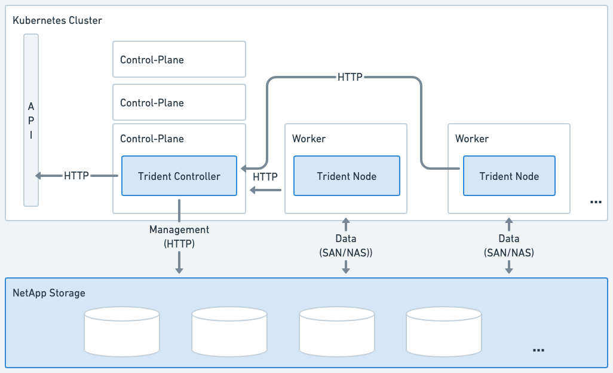
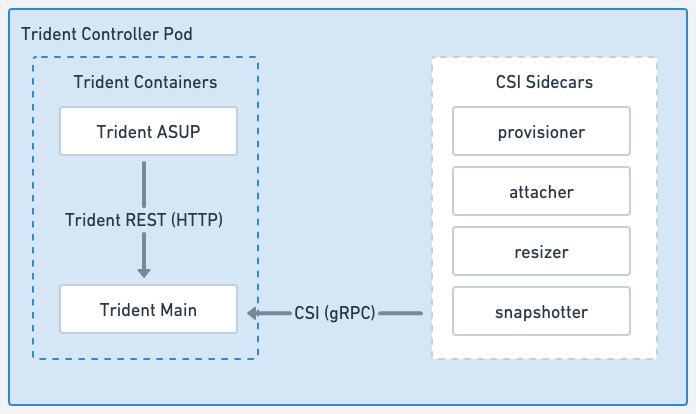

= Architecture d'Astra Trident
:hardbreaks:
:allow-uri-read: 
:icons: font
:imagesdir: ../media/

[role="lead"]
ASTRA Trident s'exécute en tant que pod unique de contrôleur et comme pod de nœud sur chaque nœud worker dans le cluster. Le pod de nœuds doit être exécuté sur n'importe quel hôte sur lequel vous souhaitez potentiellement monter un volume Astra Trident.

== Présentation des pods de contrôleur et des nœuds

ASTRA Trident se déploie comme un seul système <<Pod du contrôleur Trident>> et un ou plusieurs <<Pods de nœuds Trident>> Sur le cluster Kubernetes et utilise des conteneurs Sidecar Kubernetes standard _CSI_ pour simplifier le déploiement des plug-ins CSI. link:https://kubernetes-csi.github.io/docs/sidecar-containers.html["Conteneurs Sidecar Kubernetes CSI"^] Sont gérés par la communauté Kubernetes Storage.

Kubernetes link:https://kubernetes.io/docs/concepts/scheduling-eviction/assign-pod-node/["sélecteurs de nœuds"^] et link:https://kubernetes.io/docs/concepts/scheduling-eviction/taint-and-toleration/["tolérances et rejets"^] sont utilisés pour contraindre un pod à s'exécuter sur un nœud spécifique ou préféré. Vous pouvez configurer des sélecteurs de nœuds et des tolérances pour les pods de contrôleur et de nœud lors de l'installation d'Astra Trident.

* Le plug-in du contrôleur gère le provisionnement et la gestion des volumes, tels que les snapshots et le redimensionnement.
* Le plug-in du nœud permet d'attacher le stockage au nœud.

.ASTRA Trident a été déployé sur le cluster Kubernetes

=== Pod du contrôleur Trident

Le pod du contrôleur Trident est un pod unique exécutant le plug-in du contrôleur CSI.

* Responsable du provisionnement et de la gestion des volumes dans le stockage NetApp
* Géré par un déploiement Kubernetes
* Peut s'exécuter sur le plan de contrôle ou les nœuds workers, selon les paramètres d'installation.

.Diagramme du module de contrôleur Trident

=== Pods de nœuds Trident

Les pods de nœud Trident sont des pods privilégiés exécutant le plug-in CSI Node.

* Responsable du montage et du démontage du stockage des pods qui s'exécutent sur l'hôte
* Géré par un jeu de démonstration Kubernetes
* Doit s'exécuter sur n'importe quel nœud qui montera le stockage NetApp

.Diagramme Trident Node Pod
image::../media/node-pod.png[Schéma du pod de nœud Trident exécutant le plug-in du nœud CSI avec le side-car CSI applicable.]

== Architectures de cluster Kubernetes prises en charge

Astra Trident est pris en charge avec les architectures Kubernetes suivantes :

[cols="3,1,2"]
|===
| Architectures en cluster Kubernetes | Pris en charge | Installation par défaut 

| Maître unique, calcul | Oui.  a| 
Oui.

| Plusieurs maîtres, calcul | Oui.  a| 
Oui.

| Maître, `etcd`, calculer | Oui.  a| 
Oui.

| Maîtrise, infrastructure, calcul | Oui.  a| 
Oui.

|===