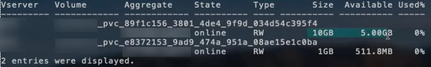

= Options et exemples de configuration du NAS ONTAP
:hardbreaks:
:allow-uri-read: 
:icons: font
:imagesdir: ../media/

Découvrez comment créer et utiliser des pilotes NAS ONTAP avec votre installation d'Astra Trident. Cette section présente des exemples de configuration du back-end et des détails sur le mappage des systèmes back-end aux classes de stockage.

== Options de configuration du back-end

Voir le tableau suivant pour les options de configuration du back-end :

[cols="3"]
|===
| Paramètre | Description | Valeur par défaut 

| `version` |  | Toujours 1 

| `storageDriverName` | Nom du pilote de stockage | ontap-nas, ontap-nas-économie, ontap-nas-flexgroup, ontap-san », « ontap-san », « ontap-économie san » 

| `backendName` | Nom personnalisé ou système back-end de stockage | Nom du pilote + "_" + dataLIF 

| `managementLIF` | Adresse IP d'un cluster ou d'une LIF de gestion SVM pour un basculement MetroCluster transparent, vous devez spécifier une LIF de gestion SVM. Un nom de domaine complet (FQDN) peut être spécifié. Peut être configuré pour utiliser des adresses IPv6 si Astra Trident a été installé à l'aide du `--use-ipv6` drapeau. Les adresses IPv6 doivent être définies entre crochets, telles que [28e8:d9fb:a825:b7bf:69a8:d02f:9e7b:3555]. | « 10.0.0.1 », « [2001:1234:abcd::fefe] » 

| `dataLIF` | Adresse IP de la LIF de protocole. Nous vous recommandons de spécifier `dataLIF`. Si elle n'est pas fournie, Astra Trident extrait les LIF de données du SVM. Vous pouvez spécifier un nom de domaine complet (FQDN) à utiliser pour les opérations de montage NFS, permettant de créer un DNS Round-Robin pour équilibrer la charge sur plusieurs LIF de données. Peut être modifié après le réglage initial. Reportez-vous à la section . Peut être configuré pour utiliser des adresses IPv6 si Astra Trident a été installé à l'aide du `--use-ipv6` drapeau. Les adresses IPv6 doivent être définies entre crochets, telles que [28e8:d9fb:a825:b7bf:69a8:d02f:9e7b:3555]. | Adresse spécifiée ou dérivée d'un SVM, si non spécifiée (non recommandé) 

| `autoExportPolicy` | Activer la création et la mise à jour automatiques des règles d'exportation [booléennes]. À l'aide du `autoExportPolicy` et `autoExportCIDRs` Avec Astra Trident, il peut gérer automatiquement les règles d'exportation. | faux 

| `autoExportCIDRs` | Liste des CIDR pour filtrer les adresses IP du nœud Kubernetes par rapport à quand `autoExportPolicy` est activé. À l'aide du `autoExportPolicy` et `autoExportCIDRs` Avec Astra Trident, il peut gérer automatiquement les règles d'exportation. | [“0.0.0.0/0”, “::/0”]” 

| `labels` | Ensemble d'étiquettes arbitraires au format JSON à appliquer aux volumes | « » 

| `clientCertificate` | Valeur encodée en Base64 du certificat client. Utilisé pour l'authentification par certificat | « » 

| `clientPrivateKey` | Valeur encodée en Base64 de la clé privée du client. Utilisé pour l'authentification par certificat | « » 

| `trustedCACertificate` | Valeur encodée en Base64 du certificat CA de confiance. Facultatif. Utilisé pour l'authentification par certificat | « » 

| `username` | Nom d'utilisateur pour la connexion au cluster/SVM. Utilisé pour l'authentification basée sur les identifiants |  

| `password` | Mot de passe pour la connexion au cluster/SVM. Utilisé pour l'authentification basée sur les identifiants |  

| `svm` | Serveur virtuel de stockage à utiliser | Dérivé d'un SVM `managementLIF` est spécifié 

| `storagePrefix` | Préfixe utilisé pour le provisionnement des nouveaux volumes dans la SVM. Ne peut pas être mis à jour une fois que vous l'avez défini | trident 

| `limitAggregateUsage` | Echec du provisionnement si l'utilisation est supérieure à ce pourcentage. *Ne s'applique pas à Amazon FSX pour ONTAP* | « » (non appliqué par défaut) 

| `limitVolumeSize` | Echec du provisionnement si la taille du volume demandé est supérieure à cette valeur. | « » (non appliqué par défaut) 

| `limitVolumeSize` | Echec du provisionnement si la taille du volume demandé est supérieure à cette valeur. Restreint également la taille maximale des volumes qu'il gère pour les qtrees et les LUN, et la `qtreesPerFlexvol` L'option permet de personnaliser le nombre maximal de qtree par FlexVol. | « » (non appliqué par défaut) 

| `lunsPerFlexvol` | Nombre maximal de LUN par FlexVol, doit être compris dans la plage [50, 200] | “100” 

| `debugTraceFlags` | Indicateurs de débogage à utiliser lors du dépannage. Par exemple, {“api”:false, “méthode”:true} ne pas utiliser `debugTraceFlags` à moins que vous ne soyez en mesure de dépanner et que vous ayez besoin d'un vidage détaillé des journaux. | nul 

| `nfsMountOptions` | Liste des options de montage NFS séparée par des virgules. Les options de montage des volumes Kubernetes persistants sont généralement spécifiées dans les classes de stockage, mais si aucune option de montage n'est spécifiée dans une classe de stockage, Astra Trident utilisera les options de montage spécifiées dans le fichier de configuration du système back-end. Si aucune option de montage n'est spécifiée dans la classe de stockage ou le fichier de configuration, Astra Trident ne définit aucune option de montage sur un volume persistant associé. | « » 

| `qtreesPerFlexvol` | Nombre maximal de qtrees par FlexVol, qui doit être compris dans la plage [50, 300] | “200” 

| `useREST` | Paramètre booléen pour utiliser les API REST de ONTAP. *Aperçu technique*
`useREST` est fourni sous forme d'aperçu technique ** qui est recommandé pour les environnements de test et non pour les charges de travail de production. Lorsqu'il est réglé sur `true`, Astra Trident va utiliser les API REST de ONTAP pour communiquer avec le système back-end. Cette fonctionnalité requiert ONTAP 9.11.1 et versions ultérieures. En outre, le rôle de connexion ONTAP utilisé doit avoir accès au `ontap` client supplémentaire. Ceci est satisfait par le pré-défini `vsadmin` et `cluster-admin` rôles.
`useREST` N'est pas pris en charge par MetroCluster. | faux 
|===

=== Options de configuration back-end pour les volumes de provisionnement

Vous pouvez contrôler le provisionnement par défaut à l'aide de ces options dans `defaults` section de la configuration. Pour un exemple, voir les exemples de configuration ci-dessous.

=== Options de configuration back-end pour les volumes de provisionnement

Vous pouvez contrôler la façon dont chaque volume est provisionné par défaut à l'aide de ces options dans une section spéciale de la configuration. Pour un exemple, voir les exemples de configuration ci-dessous.

[cols="3"]
|===
| Paramètre | Description | Valeur par défaut 

| `spaceAllocation` | Allocation d'espace pour les LUN | « vrai » 

| `spaceReserve` | Mode de réservation d'espace ; “none” (fin) ou “volume” (épais) | « aucun » 

| `snapshotPolicy` | Règle Snapshot à utiliser | « aucun » 

| `qosPolicy` | QoS policy group à affecter pour les volumes créés. Choisissez une de qosPolicy ou adaptiveQosPolicy par pool de stockage/back-end | « » 

| `adaptiveQosPolicy` | Groupe de règles de QoS adaptative à attribuer aux volumes créés. Choisissez une de qosPolicy ou adaptiveQosPolicy par pool de stockage/back-end. Non pris en charge par l'économie ontap-nas. | « » 

| `snapshotReserve` | Pourcentage du volume réservé pour les instantanés “0” | Si `snapshotPolicy` est « aucun », sinon « » 

| `splitOnClone` | Séparer un clone de son parent lors de sa création | « faux » 

| `encryption` | Activez NetApp Volume Encryption (NVE) sur le nouveau volume. La valeur par défaut est `false`. Pour utiliser cette option, NVE doit être sous licence et activé sur le cluster. Si NAE est activé sur le back-end, tous les volumes provisionnés dans Astra Trident seront activés par NAE. Pour plus d'informations, se reporter à : link:../trident-reco/security-reco.html["Fonctionnement d'Astra Trident avec NVE et NAE"]. | « faux » 

| `tieringPolicy` | La stratégie de hiérarchisation à utiliser « none » | Snapshot uniquement pour une configuration SVM-DR pré-ONTAP 9.5 

| `unixPermissions` | Mode pour les nouveaux volumes | “777” pour volumes NFS ; vide (non applicable) pour volumes SMB 

| `snapshotDir` | Contrôle la visibilité du `.snapshot` répertoire | « faux » 

| `exportPolicy` | Export policy à utiliser | « par défaut » 

| `securityStyle` | Style de sécurité pour les nouveaux volumes | « unix » pour volumes NFS ; « ntfs » pour volumes SMB 
|===

NOTE: Avec Astra Trident, les groupes de règles de QoS doivent être utilisés avec ONTAP 9.8 ou version ultérieure. Il est recommandé d'utiliser un groupe de règles de qualité de service non partagé et de s'assurer que le groupe de règles est appliqué à chaque composant individuellement. Un groupe de règles de QoS partagé appliquera le plafond du débit total de toutes les charges de travail.

==== Exemples de provisionnement de volumes

Voici un exemple avec des valeurs par défaut définies :

[listing]
----
{
  "version": 1,
  "storageDriverName": "ontap-nas",
  "backendName": "customBackendName",
  "managementLIF": "10.0.0.1",
  "dataLIF": "10.0.0.2",
  "labels": {"k8scluster": "dev1", "backend": "dev1-nasbackend"},
  "svm": "trident_svm",
  "username": "cluster-admin",
  "password": "password",
  "limitAggregateUsage": "80%",
  "limitVolumeSize": "50Gi",
  "nfsMountOptions": "nfsvers=4",
  "debugTraceFlags": {"api":false, "method":true},
  "defaults": {
    "spaceReserve": "volume",
    "qosPolicy": "premium",
    "exportPolicy": "myk8scluster",
    "snapshotPolicy": "default",
    "snapshotReserve": "10"
  }
}
----
Pour `ontap-nas` et `ontap-nas-flexgroups`, Astra Trident utilise maintenant un nouveau calcul pour s'assurer que la FlexVol est correctement dimensionnée avec le pourcentage de snapshots et la demande de volume persistant. Lorsque l'utilisateur demande de volume persistant, Astra Trident crée le FlexVol d'origine avec plus d'espace en utilisant le nouveau calcul. Ce calcul garantit que l'utilisateur reçoit l'espace inscriptible demandé dans la demande de volume persistant et qu'il ne dispose pas d'un espace minimal par rapport à ce qu'il a demandé. Avant le 21.07, lorsque l'utilisateur demande une demande de volume persistant (par exemple, 5 Gio), et le snapshotReserve à 50 %, ils ne bénéficient que d'un espace inscriptible de 2,5 Gio. En effet, le nom d'utilisateur requis correspond à l'intégralité du volume et `snapshotReserve` représente un pourcentage de cela. Avec Trident 21.07, il s'agit de l'espace inscriptible demandé par l'utilisateur et d'Astra Trident définit le `snapshotReserve` nombre comme pourcentage de l'intégralité du volume. Cela ne s'applique pas à `ontap-nas-economy`. Voir l'exemple suivant pour voir comment cela fonctionne :

Le calcul est le suivant :

[listing]
----
Total volume size = (PVC requested size) / (1 - (snapshotReserve percentage) / 100)
----
Pour les snapshots Reserve = 50 %, et demande en volume PVC = 5 Gio, la taille totale du volume est 2/0,5 = 10 Gio et la taille disponible est de 5 Gio, ce que l'utilisateur a demandé dans la demande de demande de volume persistant. Le `volume show` la commande doit afficher des résultats similaires à cet exemple :

Les systèmes back-end des installations précédentes provisionnent les volumes comme expliqué ci-dessus lors de la mise à niveau d'Astra Trident. Pour les volumes que vous avez créés avant la mise à niveau, vous devez redimensionner leurs volumes afin que la modification puisse être observée. Par exemple, un PVC de 2 Gio avec `snapshotReserve=50` Auparavant, un volume doté d'un espace inscriptible de 1 Gio. Le redimensionnement du volume à 3 Gio, par exemple, fournit l'application avec 3 Gio d'espace inscriptible sur un volume de 6 Gio.

== Exemples

=== Exemples de configuration minimaux

Les exemples suivants montrent des configurations de base qui laissent la plupart des paramètres par défaut. C'est la façon la plus simple de définir un back-end.

NOTE: Si vous utilisez Amazon FSX sur NetApp ONTAP avec Trident, nous vous recommandons de spécifier des noms DNS pour les LIF au lieu d'adresses IP.

.Options par défaut sur <code> MTAP-nas-</code>
[%collapsible%open]
====
[listing]
----
{
    "version": 1,
    "storageDriverName": "ontap-nas-economy",
    "managementLIF": "10.0.0.1",
    "dataLIF": "10.0.0.2",
    "svm": "svm_nfs",
    "username": "vsadmin",
    "password": "secret"
}
----
====
.Authentification basée sur des certificats
[%collapsible%open]
====
Il s'agit d'un exemple de configuration back-end minimal. `clientCertificate`, `clientPrivateKey`, et `trustedCACertificate` (Facultatif, si vous utilisez une autorité de certification approuvée) est renseigné `backend.json` Et prendre les valeurs codées en base64 du certificat client, de la clé privée et du certificat CA de confiance, respectivement.

[listing]
----
{
  "version": 1,
  "backendName": "DefaultNASBackend",
  "storageDriverName": "ontap-nas",
  "managementLIF": "10.0.0.1",
  "dataLIF": "10.0.0.15",
  "svm": "nfs_svm",
  "clientCertificate": "ZXR0ZXJwYXB...ICMgJ3BhcGVyc2",
  "clientPrivateKey": "vciwKIyAgZG...0cnksIGRlc2NyaX",
  "trustedCACertificate": "zcyBbaG...b3Igb3duIGNsYXNz",
  "storagePrefix": "myPrefix_"
}
----
====
.Export policy auto
[%collapsible%open]
====
Ces exemples vous montrent comment vous pouvez demander à Astra Trident d'utiliser des règles d'exportation dynamiques pour créer et gérer automatiquement les règles d'exportation. Cela fonctionne de la même manière pour le `ontap-nas-economy` et `ontap-nas-flexgroup` pilotes.

.pilote économique ontap-nas
[listing]
----
{
    "version": 1,
    "storageDriverName": "ontap-nas",
    "managementLIF": "10.0.0.1",
    "dataLIF": "10.0.0.2",
    "svm": "svm_nfs",
    "labels": {"k8scluster": "test-cluster-east-1a", "backend": "test1-nasbackend"},
    "autoExportPolicy": true,
    "autoExportCIDRs": ["10.0.0.0/24"],
    "username": "admin",
    "password": "secret",
    "nfsMountOptions": "nfsvers=4",
}
----
.pilote <code> </code> tap-nas-flexs
[listing]
----
{
    "version": 1,
    "storageDriverName": "ontap-nas-flexgroup",
    "managementLIF": "10.0.0.1",
    "dataLIF": "10.0.0.2",
    "labels": {"k8scluster": "test-cluster-east-1b", "backend": "test1-ontap-cluster"},
    "svm": "svm_nfs",
    "username": "vsadmin",
    "password": "secret",
}
----
====
.Utilisation des adresses IPv6
[%collapsible%open]
====
Cet exemple montre `managementLIF` Utilisation d'une adresse IPv6.

[listing]
----
{
 "version": 1,
 "storageDriverName": "ontap-nas",
 "backendName": "nas_ipv6_backend",
 "managementLIF": "[5c5d:5edf:8f:7657:bef8:109b:1b41:d491]",
 "labels": {"k8scluster": "test-cluster-east-1a", "backend": "test1-ontap-ipv6"},
 "svm": "nas_ipv6_svm",
 "username": "vsadmin",
 "password": "netapp123"
}
----
====

=== `ontap-nas-economy` conducteur

[listing]
----
{
    "version": 1,
    "storageDriverName": "ontap-nas-economy",
    "managementLIF": "10.0.0.1",
    "dataLIF": "10.0.0.2",
    "svm": "svm_nfs",
    "username": "vsadmin",
    "password": "secret"
}
----

=== `ontap-nas` Pilote pour Amazon FSX pour ONTAP utilisant des volumes SMB

[listing]
----
{
  "version": 1,
  "backendName": "SMBBackend",
  "storageDriverName": "ontap-nas",
  "managementLIF": "example.mgmt.fqdn.aws.com",
  “nasType”: “smb”,
  "dataLIF": "10.0.0.15",
  "svm": "nfs_svm",
  "clientCertificate": "ZXR0ZXJwYXB...ICMgJ3BhcGVyc2",
  "clientPrivateKey": "vciwKIyAgZG...0cnksIGRlc2NyaX",
  "trustedCACertificate": "zcyBbaG...b3Igb3duIGNsYXNz",
  "storagePrefix": "myPrefix_"
}
----

== Exemples de systèmes back-end avec pools virtuels

Dans l'exemple de fichier de définition backend ci-dessous, des valeurs par défaut spécifiques sont définies pour tous les pools de stockage, par exemple `spaceReserve` aucune, `spaceAllocation` lors de la fausse idée, et `encryption` faux. Les pools virtuels sont définis dans la section stockage.

Astra Trident définit les étiquettes de provisionnement dans le champ « Commentaires ». Les commentaires sont définis sur FlexVol pour `ontap-nas` Ou FlexGroup pour `ontap-nas-flexgroup`. Astra Trident copie toutes les étiquettes présentes sur un pool virtuel vers le volume de stockage lors du provisionnement. Pour plus de commodité, les administrateurs du stockage peuvent définir des étiquettes par pool virtuel et les volumes de groupe par étiquette.

Dans cet exemple, certains pools de stockage sont propriétaires de leur propre pool `spaceReserve`, `spaceAllocation`, et `encryption` les valeurs et certains pools remplacent les valeurs par défaut définies ci-dessus.

.pilote <code> </code> de prise de contact
[%collapsible%open]
====
[listing]
----
{
    {
    "version": 1,
    "storageDriverName": "ontap-nas",
    "managementLIF": "10.0.0.1",
    "dataLIF": "10.0.0.2",
    "svm": "svm_nfs",
    "username": "admin",
    "password": "secret",
    "nfsMountOptions": "nfsvers=4",

    "defaults": {
          "spaceReserve": "none",
          "encryption": "false",
          "qosPolicy": "standard"
    },
    "labels":{"store":"nas_store", "k8scluster": "prod-cluster-1"},
    "region": "us_east_1",
    "storage": [
        {
            "labels":{"app":"msoffice", "cost":"100"},
            "zone":"us_east_1a",
            "defaults": {
                "spaceReserve": "volume",
                "encryption": "true",
                "unixPermissions": "0755",
                "adaptiveQosPolicy": "adaptive-premium"
            }
        },
        {
            "labels":{"app":"slack", "cost":"75"},
            "zone":"us_east_1b",
            "defaults": {
                "spaceReserve": "none",
                "encryption": "true",
                "unixPermissions": "0755"
            }
        },
        {
            "labels":{"app":"wordpress", "cost":"50"},
            "zone":"us_east_1c",
            "defaults": {
                "spaceReserve": "none",
                "encryption": "true",
                "unixPermissions": "0775"
            }
        },
        {
            "labels":{"app":"mysqldb", "cost":"25"},
            "zone":"us_east_1d",
            "defaults": {
                "spaceReserve": "volume",
                "encryption": "false",
                "unixPermissions": "0775"
            }
        }
    ]
}
----
====
.pilote <code> </code> tap-nas-flexs
[%collapsible%open]
====
[listing]
----
{
    "version": 1,
    "storageDriverName": "ontap-nas-flexgroup",
    "managementLIF": "10.0.0.1",
    "dataLIF": "10.0.0.2",
    "svm": "svm_nfs",
    "username": "vsadmin",
    "password": "secret",

    "defaults": {
          "spaceReserve": "none",
          "encryption": "false"
    },
    "labels":{"store":"flexgroup_store", "k8scluster": "prod-cluster-1"},
    "region": "us_east_1",
    "storage": [
        {
            "labels":{"protection":"gold", "creditpoints":"50000"},
            "zone":"us_east_1a",
            "defaults": {
                "spaceReserve": "volume",
                "encryption": "true",
                "unixPermissions": "0755"
            }
        },
        {
            "labels":{"protection":"gold", "creditpoints":"30000"},
            "zone":"us_east_1b",
            "defaults": {
                "spaceReserve": "none",
                "encryption": "true",
                "unixPermissions": "0755"
            }
        },
        {
            "labels":{"protection":"silver", "creditpoints":"20000"},
            "zone":"us_east_1c",
            "defaults": {
                "spaceReserve": "none",
                "encryption": "true",
                "unixPermissions": "0775"
            }
        },
        {
            "labels":{"protection":"bronze", "creditpoints":"10000"},
            "zone":"us_east_1d",
            "defaults": {
                "spaceReserve": "volume",
                "encryption": "false",
                "unixPermissions": "0775"
            }
        }
    ]
}
----
====
.pilote <code> </code> de la carte™ stap-nas-economs™
[%collapsible%open]
====
[listing]
----
{
    "version": 1,
    "storageDriverName": "ontap-nas-economy",
    "managementLIF": "10.0.0.1",
    "dataLIF": "10.0.0.2",
    "svm": "svm_nfs",
    "username": "vsadmin",
    "password": "secret",

    "defaults": {
          "spaceReserve": "none",
          "encryption": "false"
    },
    "labels":{"store":"nas_economy_store"},
    "region": "us_east_1",
    "storage": [
        {
            "labels":{"department":"finance", "creditpoints":"6000"},
            "zone":"us_east_1a",
            "defaults": {
                "spaceReserve": "volume",
                "encryption": "true",
                "unixPermissions": "0755"
            }
        },
        {
            "labels":{"department":"legal", "creditpoints":"5000"},
            "zone":"us_east_1b",
            "defaults": {
                "spaceReserve": "none",
                "encryption": "true",
                "unixPermissions": "0755"
            }
        },
        {
            "labels":{"department":"engineering", "creditpoints":"3000"},
            "zone":"us_east_1c",
            "defaults": {
                "spaceReserve": "none",
                "encryption": "true",
                "unixPermissions": "0775"
            }
        },
        {
            "labels":{"department":"humanresource", "creditpoints":"2000"},
            "zone":"us_east_1d",
            "defaults": {
                "spaceReserve": "volume",
                "encryption": "false",
                "unixPermissions": "0775"
            }
        }
    ]
}
----
====

== Mise à jour `dataLIF` après la configuration initiale

Vous pouvez modifier la LIF de données après la configuration initiale en exécutant la commande suivante pour fournir le nouveau fichier JSON back-end avec la LIF de données mise à jour.

[listing]
----
tridentctl update backend <backend-name> -f <path-to-backend-json-file-with-updated-dataLIF>
----

NOTE: Si des demandes de volume persistant sont associées à un ou plusieurs pods, tous les pods correspondants doivent être arrêtés, puis réintégrés dans le but de permettre la nouvelle LIF de données d'être effective.

== Mappage des systèmes back-end aux classes de stockage

Les définitions de classe de stockage suivantes font référence aux pools virtuels ci-dessus. À l'aide du `parameters.selector` Chaque classe de stockage indique quel(s) pool(s) virtuel(s) peut(s) être utilisé(s) pour héberger un volume. Les aspects définis dans le pool virtuel sélectionné seront définis pour le volume.

* La première classe de stockage (`protection-gold`) sera mappé sur le premier, deuxième pool virtuel dans le `ontap-nas-flexgroup` système back-end et le premier pool virtuel dans le `ontap-san` back-end. Il s'agit du seul pool offrant une protection de niveau Gold.
* La deuxième classe de stockage (`protection-not-gold`) sera mappé sur le troisième, quatrième pool virtuel dans `ontap-nas-flexgroup` back-end et le deuxième, troisième pool virtuel dans `ontap-san` back-end. Ce sont les seuls pools offrant un niveau de protection autre que l'or.
* La troisième classe de stockage (`app-mysqldb`) sera mappé sur le quatrième pool virtuel dans `ontap-nas` back-end et le troisième pool virtuel dans `ontap-san-economy` back-end. Ce sont les seuls pools offrant une configuration de pool de stockage pour l'application de type mysqldb.
* La quatrième classe de stockage (`protection-silver-creditpoints-20k`) sera mappé sur le troisième pool virtuel dans `ontap-nas-flexgroup` back-end et le second pool virtuel dans `ontap-san` back-end. Ce sont les seules piscines offrant une protection de niveau or à 20000 points de solvabilité.
* La cinquième classe de stockage (`creditpoints-5k`) sera mappé sur le second pool virtuel dans `ontap-nas-economy` back-end et le troisième pool virtuel dans `ontap-san` back-end. Ce sont les seules offres de piscine à 5000 points de solvabilité.

Astra Trident va décider du pool virtuel sélectionné et s'assurer que les besoins en stockage sont satisfaits.

[listing]
----
apiVersion: storage.k8s.io/v1
kind: StorageClass
metadata:
  name: protection-gold
provisioner: netapp.io/trident
parameters:
  selector: "protection=gold"
  fsType: "ext4"
---
apiVersion: storage.k8s.io/v1
kind: StorageClass
metadata:
  name: protection-not-gold
provisioner: netapp.io/trident
parameters:
  selector: "protection!=gold"
  fsType: "ext4"
---
apiVersion: storage.k8s.io/v1
kind: StorageClass
metadata:
  name: app-mysqldb
provisioner: netapp.io/trident
parameters:
  selector: "app=mysqldb"
  fsType: "ext4"
---
apiVersion: storage.k8s.io/v1
kind: StorageClass
metadata:
  name: protection-silver-creditpoints-20k
provisioner: netapp.io/trident
parameters:
  selector: "protection=silver; creditpoints=20000"
  fsType: "ext4"
---
apiVersion: storage.k8s.io/v1
kind: StorageClass
metadata:
  name: creditpoints-5k
provisioner: netapp.io/trident
parameters:
  selector: "creditpoints=5000"
  fsType: "ext4"
----