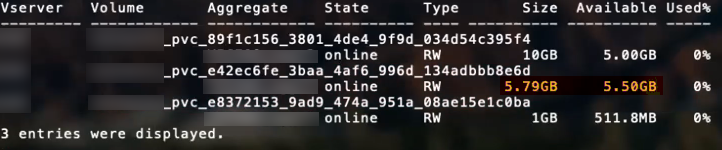

= Options et exemples de configuration des SAN ONTAP
:hardbreaks:
:allow-uri-read: 
:icons: font
:imagesdir: ../media/

Découvrez comment créer et utiliser des pilotes SAN ONTAP avec votre installation d'Astra Trident. Cette section présente des exemples de configuration du back-end et des détails sur le mappage des systèmes back-end aux classes de stockage.

== Options de configuration du back-end

Voir le tableau suivant pour les options de configuration du back-end :

[cols="3"]
|===
| Paramètre | Description | Valeur par défaut 

| `version` |  | Toujours 1 

| `storageDriverName` | Nom du pilote de stockage | ontap-nas, ontap-nas-économie, ontap-nas-flexgroup, ontap-san », « ontap-san », « ontap-économie san » 

| `backendName` | Nom personnalisé ou système back-end de stockage | Nom du pilote + "_" + dataLIF 

| `managementLIF` | Adresse IP d'un cluster ou d'une LIF de gestion SVM pour un basculement MetroCluster transparent, vous devez spécifier une LIF de gestion SVM. | « 10.0.0.1 », « [2001:1234:abcd::fefe] » 

| `dataLIF` | Adresse IP de la LIF de protocole. Utilisez des crochets pour IPv6. Ne peut pas être mis à jour une fois que vous l'avez défini | Dérivé par la SVM sauf spécification 

| `useCHAP` | Utiliser CHAP pour authentifier iSCSI pour les pilotes SAN ONTAP [Boolean] | faux 

| `chapInitiatorSecret` | Secret de l'initiateur CHAP. Requis si `useCHAP=true` | « » 

| `labels` | Ensemble d'étiquettes arbitraires au format JSON à appliquer aux volumes | « » 

| `chapTargetInitiatorSecret` | Secret de l'initiateur cible CHAP. Requis si `useCHAP=true` | « » 

| `chapUsername` | Nom d'utilisateur entrant. Requis si `useCHAP=true` | « » 

| `chapTargetUsername` | Nom d'utilisateur cible. Requis si `useCHAP=true` | « » 

| `clientCertificate` | Valeur encodée en Base64 du certificat client. Utilisé pour l'authentification par certificat | « » 

| `clientPrivateKey` | Valeur encodée en Base64 de la clé privée du client. Utilisé pour l'authentification par certificat | « » 

| `trustedCACertificate` | Valeur encodée en Base64 du certificat CA de confiance. Facultatif. Utilisé pour l'authentification par certificat | « » 

| `username` | Nom d'utilisateur pour la connexion au cluster/SVM. Utilisé pour l'authentification basée sur les identifiants | « » 

| `password` | Mot de passe pour la connexion au cluster/SVM. Utilisé pour l'authentification basée sur les identifiants | « » 

| `svm` | Serveur virtuel de stockage à utiliser | Dérivé d'un SVM `managementLIF` est spécifié 

| `igroupName` | Nom du groupe initiateur à utiliser pour les volumes SAN | Trident-<backend-UUID> 

| `storagePrefix` | Préfixe utilisé pour le provisionnement des nouveaux volumes dans la SVM. Ne peut pas être mis à jour une fois que vous l'avez défini | trident 

| `limitAggregateUsage` | Echec du provisionnement si l'utilisation est supérieure à ce pourcentage. *Ne s'applique pas à Amazon FSX pour ONTAP* | « » (non appliqué par défaut) 

| `limitVolumeSize` | Echec du provisionnement si la taille du volume demandé est supérieure à cette valeur. | « » (non appliqué par défaut) 

| `lunsPerFlexvol` | Nombre maximal de LUN par FlexVol, doit être compris dans la plage [50, 200] | “100” 

| `debugTraceFlags` | Indicateurs de débogage à utiliser lors du dépannage. Exemple, {“api”:false, “méthode”:true} | nul 

| `useREST` | Paramètre booléen pour utiliser les API REST de ONTAP. *Aperçu technique* non pris en charge avec MetroCluster. | faux 
|===
[WARNING]
.Considérations relatives à <code> useREST</code>
====
* `useREST` est fourni sous forme d'aperçu technique ** qui est recommandé pour les environnements de test et non pour les charges de travail de production. Lorsqu'il est réglé sur `true`, Astra Trident va utiliser les API REST de ONTAP pour communiquer avec le système back-end. Cette fonctionnalité requiert ONTAP 9.10 et versions ultérieures. En outre, le rôle de connexion ONTAP utilisé doit avoir accès au `ontap` client supplémentaire. Ceci est satisfait par le pré-défini `vsadmin` et `cluster-admin` rôles.
* `useREST` N'est pas pris en charge par MetroCluster.

====
Pour communiquer avec le cluster ONTAP, vous devez fournir les paramètres d'authentification. Il peut s'agir du nom d'utilisateur/mot de passe d'une connexion de sécurité ou d'un certificat installé.

WARNING: Si vous utilisez un système Amazon FSX pour le système back-end NetApp ONTAP, ne spécifiez pas le système `limitAggregateUsage` paramètre. Le `fsxadmin` et `vsadmin` Les rôles fournis par Amazon FSX pour NetApp ONTAP ne contiennent pas les autorisations d'accès requises pour récupérer l'utilisation des agrégats et le limiter via Astra Trident.

WARNING: Ne pas utiliser `debugTraceFlags` à moins que vous ne soyez en mesure de dépanner et que vous ayez besoin d'un vidage détaillé des journaux.

Pour le `ontap-san` Pilotes, par défaut est d'utiliser toutes les adresses IP des LIF de données du SVM et d'utiliser le chemin d'accès multivoie iSCSI. Spécification d'une adresse IP pour la LIF de données pour le `ontap-san` les pilotes les obligent à désactiver le multichemin et à utiliser uniquement l'adresse spécifiée.

NOTE: Lors de la création d'un back-end, n'oubliez pas que `dataLIF` et `storagePrefix` ne peut pas être modifié après sa création. Pour mettre à jour ces paramètres, vous devez créer un nouveau back-end.

`igroupName` Peut être défini sur un groupe initiateur déjà créé sur le cluster ONTAP. Si non spécifié, Astra Trident crée automatiquement un groupe initiateur nommé trident-<back-end-UUID>. Si l'on fournit un nom de partenaire prédéfini, NetApp recommande d'utiliser un groupe initiateur par cluster Kubernetes si le SVM doit être partagé entre les environnements. Cela est nécessaire pour qu'Astra Trident conserve automatiquement les ajouts/suppressions d'IQN.

Les systèmes back-end peuvent également avoir mis à jour les groupes initiateurs après leur création :

* Vous pouvez mettre à jour le nom de l'outil afin de désigner un nouveau groupe initiateur créé et géré sur la SVM en dehors d'Astra Trident.
* Le nom de l'utilisateur peut être omis. Dans ce cas, Astra Trident crée et gère automatiquement un groupe initiateur trident-<back-end-UUID>.

Dans les deux cas, les pièces jointes de volume continueront d'être accessibles. Les pièces jointes futures utilisent le groupe initiateur mis à jour. Cette mise à jour n'interrompt pas l'accès aux volumes présents sur le back-end.

Un nom de domaine complet (FQDN) peut être spécifié pour le `managementLIF` option.

 `managementLIF` Pour tous les pilotes ONTAP peuvent également être définis sur des adresses IPv6. Veillez à installer Trident avec le `--use-ipv6` drapeau. Il faut veiller à définir `managementLIF` Adresse IPv6 entre crochets.

WARNING: Lorsque vous utilisez des adresses IPv6, assurez-vous de `managementLIF` et `dataLIF` (si inclus dans votre définition de back-end) sont définis entre crochets, tels que [28e8:d9fb:a825:b7bf:69a8:d02f:9e7b:3555]. Si `dataLIF` N'est pas fourni, Astra Trident va récupérer les LIF de données IPv6 à partir du SVM.

Pour activer les pilotes ontap-san à l'aide du protocole CHAP, définissez la `useCHAP` paramètre à `true` dans votre définition de back-end. Astra Trident configure ensuite et utilise le protocole CHAP bidirectionnel comme authentification par défaut pour la SVM donnée en back-end. Voir link:ontap-san-prep.html["ici"^] pour en savoir plus sur son fonctionnement.

Pour le `ontap-san-economy` conducteur, le `limitVolumeSize` Elle limite également la taille maximale des volumes qu'elle gère pour les qtrees et les LUN.

NOTE: Astra Trident définit les libellés de provisionnement dans le champ « Commentaires » de tous les volumes créés à l'aide de l' `ontap-san` conducteur. Pour chaque volume créé, le champ « Commentaires » de la FlexVol est rempli avec toutes les étiquettes présentes sur le pool de stockage dans lequel elle est placée. Les administrateurs de stockage peuvent définir des étiquettes par pool de stockage et regrouper tous les volumes créés dans un pool de stockage. Cela permet de différencier facilement les volumes en fonction d'un ensemble d'étiquettes personnalisables fournies dans la configuration back-end.

=== Options de configuration back-end pour les volumes de provisionnement

Vous pouvez contrôler la façon dont chaque volume est provisionné par défaut à l'aide de ces options dans une section spéciale de la configuration. Pour un exemple, voir les exemples de configuration ci-dessous.

[cols="3"]
|===
| Paramètre | Description | Valeur par défaut 

| `spaceAllocation` | Allocation d'espace pour les LUN | « vrai » 

| `spaceReserve` | Mode de réservation d'espace ; “none” (fin) ou “volume” (épais) | « aucun » 

| `snapshotPolicy` | Règle Snapshot à utiliser | « aucun » 

| `qosPolicy` | QoS policy group à affecter pour les volumes créés. Choisissez une de qosPolicy ou adaptiveQosPolicy par pool de stockage/back-end | « » 

| `adaptiveQosPolicy` | Groupe de règles de QoS adaptative à attribuer aux volumes créés. Choisissez une de qosPolicy ou adaptiveQosPolicy par pool de stockage/back-end | « » 

| `snapshotReserve` | Pourcentage du volume réservé pour les instantanés “0” | Si `snapshotPolicy` est « aucun », sinon « » 

| `splitOnClone` | Séparer un clone de son parent lors de sa création | « faux » 

| `splitOnClone` | Séparer un clone de son parent lors de sa création | « faux » 

| `encryption` | Activez NetApp Volume Encryption (NVE) sur le nouveau volume. La valeur par défaut est `false`. Pour utiliser cette option, NVE doit être sous licence et activé sur le cluster. Si NAE est activé sur le back-end, tous les volumes provisionnés dans Astra Trident seront activés par NAE. Pour plus d'informations, se reporter à : link:../trident-reco/security-reco.html["Fonctionnement d'Astra Trident avec NVE et NAE"]. | « faux » 

| `luksEncryption` | Activez le cryptage LUKS. Reportez-vous à la section link:../trident-reco/security-reco.html#Use-Linux-Unified-Key-Setup-(LUKS)["Utiliser la configuration de clé unifiée Linux (LUKS)"]. | « » 

| `securityStyle` | Style de sécurité pour les nouveaux volumes | “unix” 

| `tieringPolicy` | La stratégie de hiérarchisation à utiliser « none » | Snapshot uniquement pour une configuration SVM-DR pré-ONTAP 9.5 
|===

NOTE: Avec Astra Trident, les groupes de règles de QoS doivent être utilisés avec ONTAP 9.8 ou version ultérieure. Il est recommandé d'utiliser un groupe de règles de qualité de service non partagé et de s'assurer que le groupe de règles est appliqué à chaque composant individuellement. Un groupe de règles de QoS partagé appliquera le plafond du débit total de toutes les charges de travail.

Voici un exemple avec des valeurs par défaut définies :

[listing]
----
{
 "version": 1,
 "storageDriverName": "ontap-san",
 "managementLIF": "10.0.0.1",
 "dataLIF": "10.0.0.2",
 "svm": "trident_svm",
 "username": "admin",
 "password": "password",
 "labels": {"k8scluster": "dev2", "backend": "dev2-sanbackend"},
 "storagePrefix": "alternate-trident",
 "igroupName": "custom",
 "debugTraceFlags": {"api":false, "method":true},
 "defaults": {
     "spaceReserve": "volume",
     "qosPolicy": "standard",
     "spaceAllocation": "false",
     "snapshotPolicy": "default",
     "snapshotReserve": "10"
 }
}
----

NOTE: Pour tous les volumes créés à l'aide de `ontap-san` Avec d'autres pilotes, Astra Trident ajoute une capacité supplémentaire de 10 % au système FlexVol pour prendre en charge les métadonnées de LUN. La LUN sera provisionnée avec la taille exacte que l'utilisateur demande dans la demande de volume persistant. Astra Trident ajoute 10 % au système FlexVol (dont la taille disponible dans ONTAP). Les utilisateurs obtiennent à présent la capacité utilisable requise. Cette modification empêche également que les LUN ne soient en lecture seule, à moins que l'espace disponible soit pleinement utilisé. Cela ne s'applique pas à l'économie d'ontap-san.

Pour les systèmes back-end définis `snapshotReserve`, Astra Trident calcule la taille des volumes comme suit :

[listing]
----
Total volume size = [(PVC requested size) / (1 - (snapshotReserve percentage) / 100)] * 1.1
----
Le modèle 1.1 est le modèle 10 % d'Astra Trident supplémentaire qui s'ajoute à la baie FlexVol pour prendre en charge les métadonnées de la LUN. Pour `snapshotReserve` = 5 % et demande de volume persistant = 5 Gio, la taille totale du volume est de 5,7 Gio et la taille disponible est de 5,5 Gio. Le `volume show` la commande doit afficher des résultats similaires à cet exemple :

Actuellement, le redimensionnement est le seul moyen d'utiliser le nouveau calcul pour un volume existant.

== Exemples de configuration minimaux

Les exemples suivants montrent des configurations de base qui laissent la plupart des paramètres par défaut. C'est la façon la plus simple de définir un back-end.

NOTE: Si vous utilisez Amazon FSX sur NetApp ONTAP avec Astra Trident, il est recommandé de spécifier des noms DNS pour les LIF au lieu d'adresses IP.

=== `ontap-san` pilote avec authentification par certificat

Il s'agit d'un exemple de configuration back-end minimal. `clientCertificate`, `clientPrivateKey`, et `trustedCACertificate` (Facultatif, si vous utilisez une autorité de certification approuvée) est renseigné `backend.json` Et prendre les valeurs codées en base64 du certificat client, de la clé privée et du certificat CA de confiance, respectivement.

[listing]
----
{
    "version": 1,
    "storageDriverName": "ontap-san",
    "backendName": "DefaultSANBackend",
    "managementLIF": "10.0.0.1",
    "dataLIF": "10.0.0.3",
    "svm": "svm_iscsi",
    "useCHAP": true,
    "chapInitiatorSecret": "cl9qxIm36DKyawxy",
    "chapTargetInitiatorSecret": "rqxigXgkesIpwxyz",
    "chapTargetUsername": "iJF4heBRT0TCwxyz",
    "chapUsername": "uh2aNCLSd6cNwxyz",
    "igroupName": "trident",
    "clientCertificate": "ZXR0ZXJwYXB...ICMgJ3BhcGVyc2",
    "clientPrivateKey": "vciwKIyAgZG...0cnksIGRlc2NyaX",
    "trustedCACertificate": "zcyBbaG...b3Igb3duIGNsYXNz"
}
----

=== `ontap-san` Pilote avec CHAP bidirectionnel

Il s'agit d'un exemple de configuration back-end minimal. Cette configuration de base crée un `ontap-san` backend avec `useCHAP` réglez sur `true`.

[listing]
----
{
    "version": 1,
    "storageDriverName": "ontap-san",
    "managementLIF": "10.0.0.1",
    "dataLIF": "10.0.0.3",
    "svm": "svm_iscsi",
    "labels": {"k8scluster": "test-cluster-1", "backend": "testcluster1-sanbackend"},
    "useCHAP": true,
    "chapInitiatorSecret": "cl9qxIm36DKyawxy",
    "chapTargetInitiatorSecret": "rqxigXgkesIpwxyz",
    "chapTargetUsername": "iJF4heBRT0TCwxyz",
    "chapUsername": "uh2aNCLSd6cNwxyz",
    "igroupName": "trident",
    "username": "vsadmin",
    "password": "secret"
}
----

=== `ontap-san-economy` conducteur

[listing]
----
{
    "version": 1,
    "storageDriverName": "ontap-san-economy",
    "managementLIF": "10.0.0.1",
    "svm": "svm_iscsi_eco",
    "useCHAP": true,
    "chapInitiatorSecret": "cl9qxIm36DKyawxy",
    "chapTargetInitiatorSecret": "rqxigXgkesIpwxyz",
    "chapTargetUsername": "iJF4heBRT0TCwxyz",
    "chapUsername": "uh2aNCLSd6cNwxyz",
    "igroupName": "trident",
    "username": "vsadmin",
    "password": "secret"
}
----

== Exemples de systèmes back-end avec pools de stockage virtuel

Dans l'exemple de fichier de définition backend ci-dessous, des valeurs par défaut spécifiques sont définies pour tous les pools de stockage, par exemple `spaceReserve` aucune, `spaceAllocation` lors de la fausse idée, et `encryption` faux. Les pools de stockage virtuels sont définis dans la section stockage.

Dans cet exemple, certains pools de stockage sont propriétaires de leur propre pool `spaceReserve`, `spaceAllocation`, et `encryption` les valeurs et certains pools remplacent les valeurs par défaut définies ci-dessus.

[listing]
----
{
    "version": 1,
    "storageDriverName": "ontap-san",
    "managementLIF": "10.0.0.1",
    "dataLIF": "10.0.0.3",
    "svm": "svm_iscsi",
    "useCHAP": true,
    "chapInitiatorSecret": "cl9qxIm36DKyawxy",
    "chapTargetInitiatorSecret": "rqxigXgkesIpwxyz",
    "chapTargetUsername": "iJF4heBRT0TCwxyz",
    "chapUsername": "uh2aNCLSd6cNwxyz",
    "igroupName": "trident",
    "username": "vsadmin",
    "password": "secret",

    "defaults": {
          "spaceAllocation": "false",
          "encryption": "false",
          "qosPolicy": "standard"
    },
    "labels":{"store": "san_store", "kubernetes-cluster": "prod-cluster-1"},
    "region": "us_east_1",
    "storage": [
        {
            "labels":{"protection":"gold", "creditpoints":"40000"},
            "zone":"us_east_1a",
            "defaults": {
                "spaceAllocation": "true",
                "encryption": "true",
                "adaptiveQosPolicy": "adaptive-extreme"
            }
        },
        {
            "labels":{"protection":"silver", "creditpoints":"20000"},
            "zone":"us_east_1b",
            "defaults": {
                "spaceAllocation": "false",
                "encryption": "true",
                "qosPolicy": "premium"
            }
        },
        {
            "labels":{"protection":"bronze", "creditpoints":"5000"},
            "zone":"us_east_1c",
            "defaults": {
                "spaceAllocation": "true",
                "encryption": "false"
            }
        }
    ]
}
----
Voici un exemple iSCSI pour le `ontap-san-economy` pilote :

[listing]
----
{
    "version": 1,
    "storageDriverName": "ontap-san-economy",
    "managementLIF": "10.0.0.1",
    "svm": "svm_iscsi_eco",
    "useCHAP": true,
    "chapInitiatorSecret": "cl9qxIm36DKyawxy",
    "chapTargetInitiatorSecret": "rqxigXgkesIpwxyz",
    "chapTargetUsername": "iJF4heBRT0TCwxyz",
    "chapUsername": "uh2aNCLSd6cNwxyz",
    "igroupName": "trident",
    "username": "vsadmin",
    "password": "secret",

    "defaults": {
          "spaceAllocation": "false",
          "encryption": "false"
    },
    "labels":{"store":"san_economy_store"},
    "region": "us_east_1",
    "storage": [
        {
            "labels":{"app":"oracledb", "cost":"30"},
            "zone":"us_east_1a",
            "defaults": {
                "spaceAllocation": "true",
                "encryption": "true"
            }
        },
        {
            "labels":{"app":"postgresdb", "cost":"20"},
            "zone":"us_east_1b",
            "defaults": {
                "spaceAllocation": "false",
                "encryption": "true"
            }
        },
        {
            "labels":{"app":"mysqldb", "cost":"10"},
            "zone":"us_east_1c",
            "defaults": {
                "spaceAllocation": "true",
                "encryption": "false"
            }
        }
    ]
}
----

== Mappage des systèmes back-end aux classes de stockage

Les définitions de classe de stockage suivantes font référence aux pools de stockage virtuels ci-dessus. À l'aide du `parameters.selector` Chaque classe de stockage indique quel(s) pool(s) virtuel(s) peut(s) être utilisé(s) pour héberger un volume. Les aspects définis dans le pool virtuel sélectionné seront définis pour le volume.

* La première classe de stockage (`protection-gold`) sera mappé sur le premier, deuxième pool de stockage virtuel dans le `ontap-nas-flexgroup` système back-end et le premier pool de stockage virtuel dans `ontap-san` back-end. Il s'agit du seul pool offrant une protection de niveau Gold.
* La deuxième classe de stockage (`protection-not-gold`) sera mappé sur le troisième, quatrième pool de stockage virtuel dans `ontap-nas-flexgroup` back-end et le deuxième, troisième pool de stockage virtuel dans `ontap-san` back-end. Ce sont les seuls pools offrant un niveau de protection autre que l'or.
* La troisième classe de stockage (`app-mysqldb`) sera mappé sur le quatrième pool de stockage virtuel dans `ontap-nas` back-end et le troisième pool de stockage virtuel dans `ontap-san-economy` back-end. Ce sont les seuls pools offrant une configuration de pool de stockage pour l'application de type mysqldb.
* La quatrième classe de stockage (`protection-silver-creditpoints-20k`) sera mappé sur le troisième pool de stockage virtuel dans `ontap-nas-flexgroup` back-end et le second pool de stockage virtuel dans `ontap-san` back-end. Ce sont les seules piscines offrant une protection de niveau or à 20000 points de solvabilité.
* La cinquième classe de stockage (`creditpoints-5k`) sera mappé sur le second pool de stockage virtuel dans `ontap-nas-economy` back-end et le troisième pool de stockage virtuel dans `ontap-san` back-end. Ce sont les seules offres de piscine à 5000 points de solvabilité.

Astra Trident va décider du pool de stockage virtuel sélectionné et s'assurer que les besoins en stockage sont satisfaits.

[listing]
----
apiVersion: storage.k8s.io/v1
kind: StorageClass
metadata:
  name: protection-gold
provisioner: netapp.io/trident
parameters:
  selector: "protection=gold"
  fsType: "ext4"
---
apiVersion: storage.k8s.io/v1
kind: StorageClass
metadata:
  name: protection-not-gold
provisioner: netapp.io/trident
parameters:
  selector: "protection!=gold"
  fsType: "ext4"
---
apiVersion: storage.k8s.io/v1
kind: StorageClass
metadata:
  name: app-mysqldb
provisioner: netapp.io/trident
parameters:
  selector: "app=mysqldb"
  fsType: "ext4"
---
apiVersion: storage.k8s.io/v1
kind: StorageClass
metadata:
  name: protection-silver-creditpoints-20k
provisioner: netapp.io/trident
parameters:
  selector: "protection=silver; creditpoints=20000"
  fsType: "ext4"
---
apiVersion: storage.k8s.io/v1
kind: StorageClass
metadata:
  name: creditpoints-5k
provisioner: netapp.io/trident
parameters:
  selector: "creditpoints=5000"
  fsType: "ext4"
----