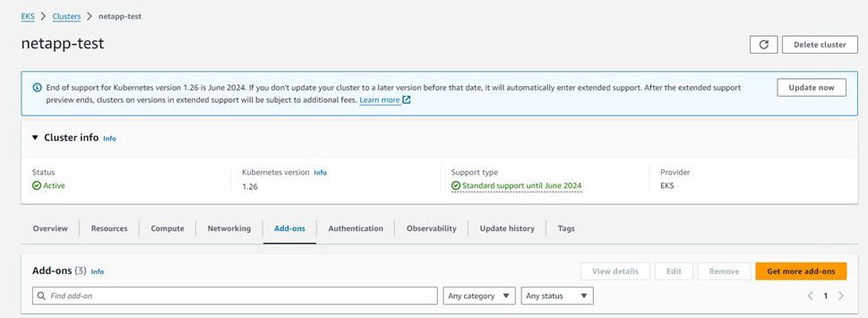
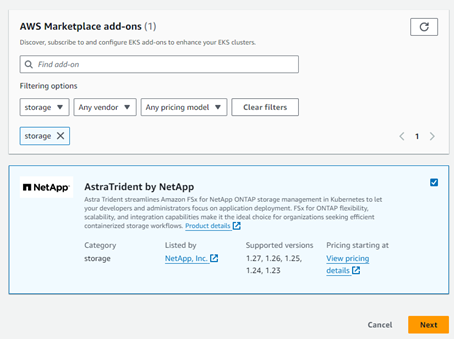
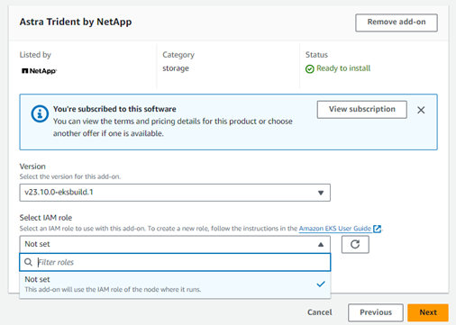
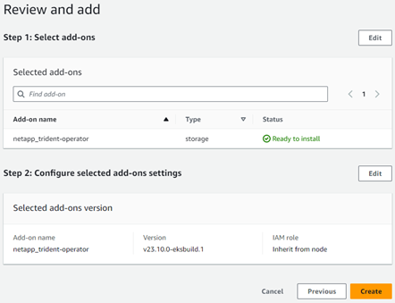
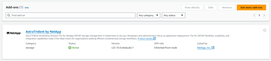

= Configurez le complément Astra Trident EKS version 23.10 sur EKS Cluser
:hardbreaks:
:allow-uri-read: 
:icons: font
:imagesdir: ../media/

[role="lead"]
ASTRA Trident simplifie la gestion du stockage Amazon FSX pour NetApp ONTAP dans Kubernetes pour que vos développeurs et administrateurs puissent donner la priorité au déploiement d'applications. Le module complémentaire Astra Trident EKS inclut les derniers correctifs de sécurité et de bogues, et il est validé par AWS pour fonctionner avec Amazon EKS. Le module complémentaire EKS vous permet de vous assurer de manière cohérente que vos clusters Amazon EKS sont sécurisés et stables et de réduire la quantité de travail à effectuer pour installer, configurer et mettre à jour des modules complémentaires.

== Prérequis

Vérifiez les points suivants avant de configurer le module complémentaire Astra Trident pour AWS EKS :

* Un compte de cluster Amazon EKS avec abonnement complémentaire
* Autorisations AWS sur AWS Marketplace :
`"aws-marketplace:ViewSubscriptions",
"aws-marketplace:Subscribe",
"aws-marketplace:Unsubscribe`
* Type ami : Amazon Linux 2 (AL2_x86_64) ou Amazon Linux 2 Arm (AL2_ARM_64)
* Type de nœud : AMD ou ARM
* Un système de fichiers Amazon FSX pour NetApp ONTAP

== Étapes

. Sur votre cluster EKS Kubernetes, accédez à l'onglet *Add-ons*.
+

. Accédez à *add-ons* AWS Marketplace et choisissez la catégorie _Storage_.
+

. Localisez *AstraTrident par NetApp* et cochez la case correspondant au module complémentaire Astra Trident.
. Choisissez la version souhaitée du module complémentaire.
+

. Sélectionnez l'option rôle IAM à hériter du nœud.
. Configurez tous les paramètres facultatifs selon les besoins et sélectionnez *Suivant*.
+

. Sélectionnez *Créer*.
. Vérifiez que l'état du complément est _Active_.
+

== Installez/désinstallez le module complémentaire Astra Trident EKS à l'aide de l'interface de ligne de commande

.Installez le module complémentaire Astra Trident EKS à l'aide de l'interface de ligne de commande :
Les exemples de commandes suivants installent le module complémentaire Astra Trident EKS :
`eksctl create addon --cluster K8s-arm --name netapp_trident-operator --version v23.10.0-eksbuild.`
`eksctl create addon --cluster K8s-arm --name netapp_trident-operator --version v23.10.0-eksbuild.1` (avec une version dédiée)

.Désinstallez le module complémentaire Astra Trident EKS à l'aide de l'interface de ligne de commande :
La commande suivante désinstalle le module complémentaire Astra Trident EKS :
`eksctl delete addon --cluster K8s-arm --name netapp_trident-operator`
